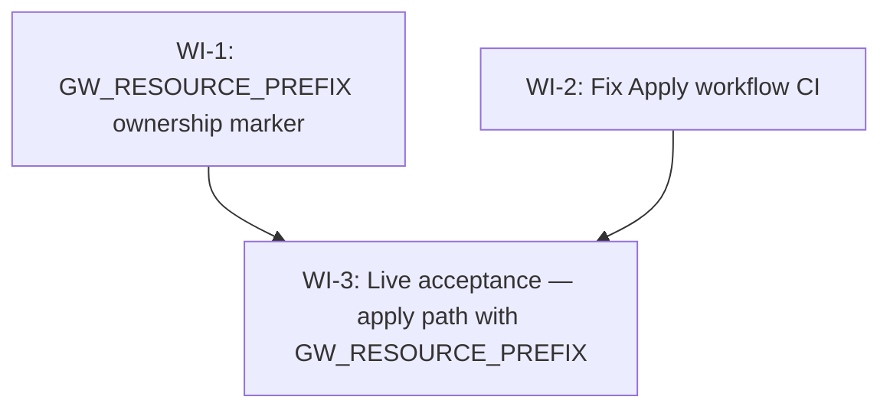

# Work-item dependency graph — INIT-2026-10-11-i3a-green-apply-path

```mermaid
graph TD
    WI-1["WI-1: GW_RESOURCE_PREFIX ownership marker"]
    WI-2["WI-2: Fix Apply workflow CI"]
    WI-3["WI-3: Live acceptance — apply path with GW_RESOURCE_PREFIX"]
    WI-1 --> WI-3
    WI-2 --> WI-3
```
