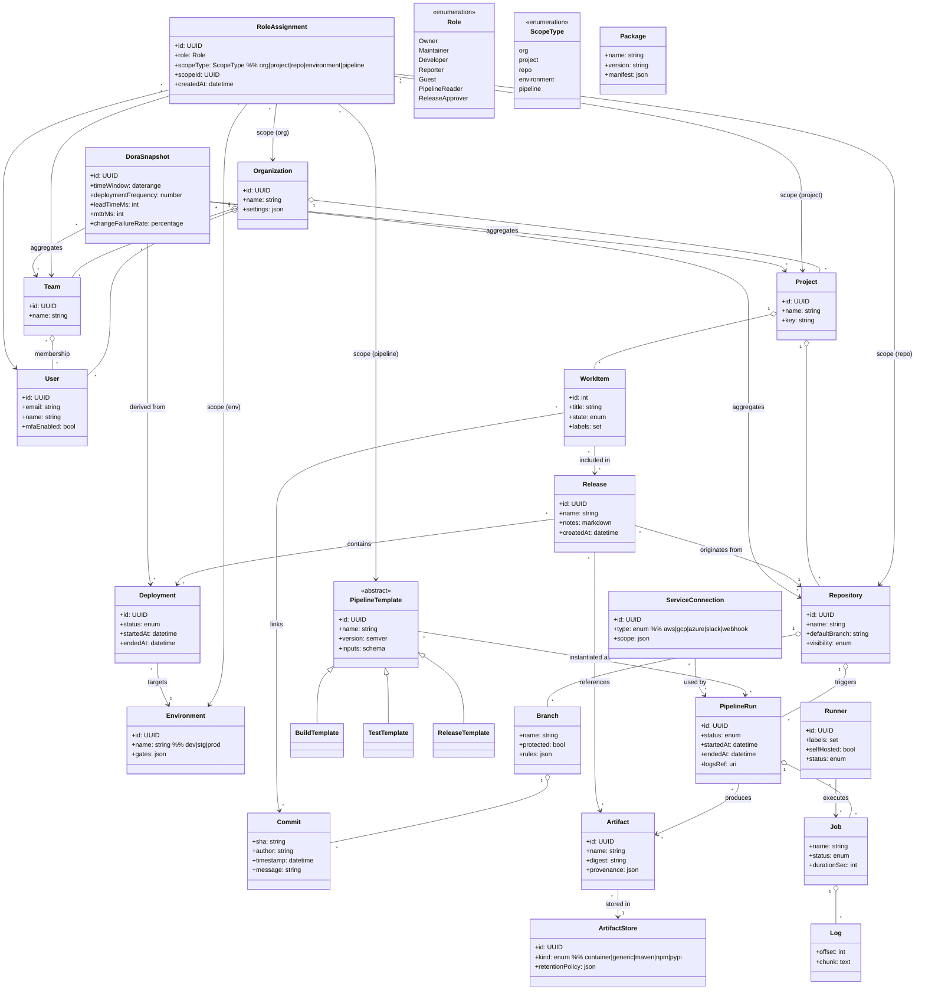
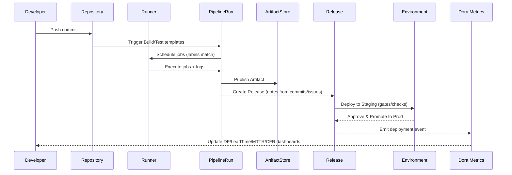

# GitWeave Domain Model (Mermaid)

> Primary entities and relationships aligned to the epic map.  
> Notes: Role assignments can target multiple scopes (Org/Project/Repo/Environment/Pipeline). Templates are versioned and executed by runners to produce artifacts and releases.

---

## (Optional) Delivery Flow (Sequence)
A high-level depiction from commit to prod deploy and metrics.

