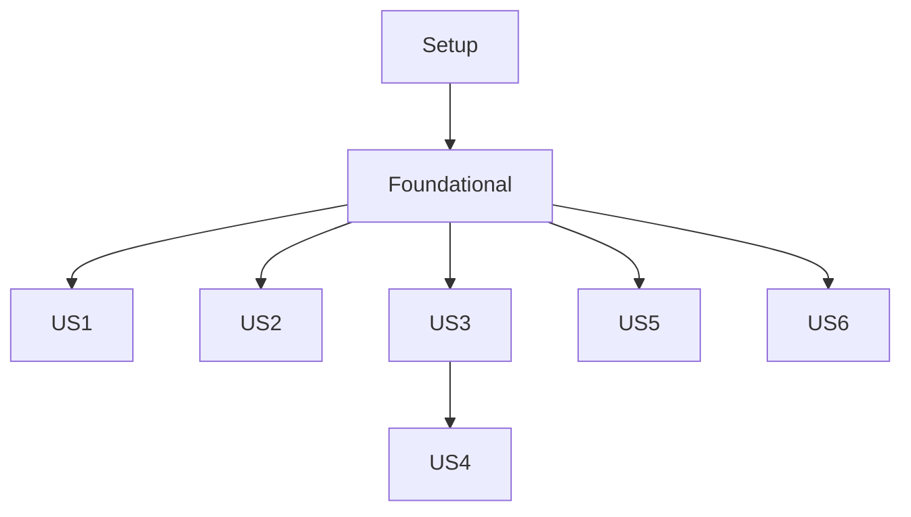

# Tasks: Control Repository Structure

**Feature**: 001-control-repo-structure
**Status**: Completed
**Spec**: [specs/001-control-repo-structure/spec.md](../001-control-repo-structure/spec.md)

## Phase 1: Setup
*Goal: Initialize the project environment.*

- [x] T001 Create `.gitignore` in repository root (include `*.tfstate`, `__pycache__`, `.terraform/`, `.DS_Store`)

## Phase 2: Foundational
*Goal: Create the physical directory structure required by all user stories.*

- [x] T002 Create root directories (`modules/`, `config/`, `infra/`, `metrics/`, `.github/workflows/`, `scripts/`)

## Phase 3: User Story 1 - Bootstrap New Organization
*Goal: Document and script the bootstrap process.*
*Priority: P1*

- [x] T003 [US1] Update/Create `README.md` with Bootstrap instructions
- [x] T004 [US1] Create `scripts/bootstrap.sh` for initial setup

## Phase 4: User Story 2 - Add Template Module
*Goal: Establish the templates directory.*
*Priority: P2*

- [x] T005 [P] [US2] Create `modules/.gitkeep` to ensure git tracking
- [x] T006 [P] [US2] Create `modules/example-template/README.md` to verify structure

## Phase 5: User Story 3 - Define Overlay Configuration
*Goal: Establish the configuration directory.*
*Priority: P2*

- [x] T007 [P] [US3] Create `config/.gitkeep` to ensure git tracking
- [x] T008 [P] [US3] Create `config/example.yaml` to verify structure

## Phase 6: User Story 5 - Infrastructure Directory
*Goal: Establish the Terraform infrastructure directory and workflow.*
*Priority: P2*

- [x] T009 [P] [US5] Create `infra/main.tf` with basic provider block
- [x] T010 [P] [US5] Create `infra/variables.tf`
- [x] T011 [P] [US5] Create `infra/outputs.tf`
- [x] T012 [P] [US5] Create `infra/bootstrap/README.md` explaining state management options
- [x] T013 [P] [US5] Create `.github/workflows/gitweave-infra.yaml` skeleton

## Phase 7: User Story 6 - Metrics Server Directory
*Goal: Establish the Metrics Observer service directory.*
*Priority: P2*

- [x] T014 [P] [US6] Create `metrics/requirements.txt` with `prometheus_client` and `requests`
- [x] T015 [P] [US6] Create `metrics/src/main.py` skeleton

## Phase 8: User Story 4 - Apply Changes Workflow
*Goal: Establish the configuration application workflow.*
*Priority: P3*

- [x] T016 [P] [US4] Create `.github/workflows/gitweave-apply.yaml` skeleton

## Phase 9: Polish & Cross-Cutting Concerns
*Goal: Final verification.*

- [x] T017 Verify directory structure against `specs/001-control-repo-structure/contracts/directory-structure.md`

## Dependencies

## Parallel Execution Opportunities

- **US2, US3, US5, US6** can be executed in parallel after Phase 2.
- **T005-T008** (File creation) are independent.
- **T009-T012** (Infra files) are independent of other stories.
- **T014-T015** (Metrics files) are independent of other stories.

## Implementation Strategy

1. **MVP (Phase 1-3)**: Get the repo structure and documentation in place.
2. **Expansion (Phase 4-7)**: Populate the specific directories for each concern.
3. **Automation (Phase 6 & 8)**: Add the CI/CD workflows.
